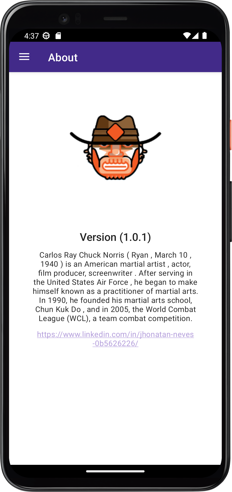

# jokeApp
Development of an application aimed at the entertainment area, JokeApp is an application idea that consumes famous API's in the market aimed at my professional growth.

## TECHNOLOGIES USED
- MVP
- API'S
- Drawer Layout
- Include
- Fragment
- Retrofit
- Navigation View
- Jetpack
- SplashScreen

 

  

## 📜 License

